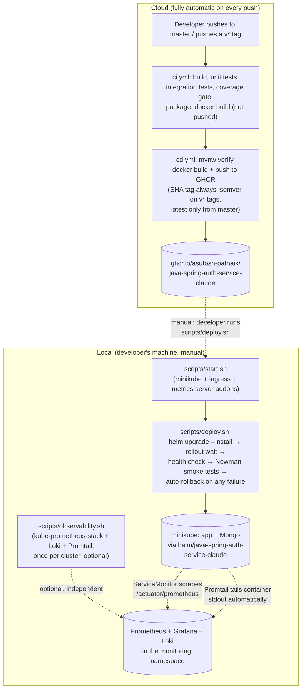

# Architecture

The CD platform is two disconnected halves joined by one manual step — not a single continuous
pipeline. That's not a limitation to work around, it's a hard fact: GitHub-hosted Actions runners
have no network path to a developer's local minikube cluster. Automating all the way from `git push`
to "running in minikube" would require registering a self-hosted runner on the same machine as
minikube, which brings its own security/maintenance surface and wasn't chosen here.

## What's real vs. what the original request diagrammed

The original ask drew one continuous arrow from `git push` through Helm, Minikube, Prometheus,
Grafana, and Loki. That's the *logical* flow of tools involved, but not how it physically runs.
GitHub Actions builds and publishes; a human runs `scripts/deploy.sh` against their own cluster.
This is the standard shape for any pipeline whose final target is a machine GitHub itself can't
reach, and it's the same reason `k8s/`'s original plain-manifest instructions (see below) were
always a manual `kubectl apply`/`minikube image load` too — this project just formalizes that same
manual step behind a script that adds health checks, smoke tests, and automatic rollback.

## Two deployment paths, on purpose

- **`k8s/`** — the original, minimal plain manifests (`mongo.yaml`, `app.yaml`, `secret.yaml`).
  Untouched by this work, still fully functional, still the simplest possible way to get the app
  running on minikube for a first look.
- **`helm/java-spring-auth-service-claude/`** — the path documented here: per-environment values, Ingress, HPA,
  ServiceMonitor/Grafana-dashboard hooks, and the `scripts/*.sh` automation built around it. This is
  the recommended path for anything beyond the original minimal demo.

Neither replaces the other; see [`../k8s/`](../k8s/) for the plain-manifest path's own comments.

## Where each piece lives

| Concern | Where |
|---|---|
| CI (build/test/coverage/package/docker build, not pushed) | `.github/workflows/ci.yml` |
| CD (build + push to GHCR) | `.github/workflows/cd.yml` |
| Helm chart | `helm/java-spring-auth-service-claude/` |
| Local automation | `scripts/*.sh` (+ shared helpers in `scripts/lib/`) |
| Observability stack install | `scripts/observability.sh` |
| Setup / deployment / rollback / troubleshooting details | the other files in this `docs/` directory |

See [setup.md](setup.md) to get a cluster ready, [deployment.md](deployment.md) for the full
`deploy.sh` walkthrough, [rollback.md](rollback.md) for undoing a bad deploy, and
[troubleshooting.md](troubleshooting.md) for the specific failure modes this was actually tested
against while building it.
